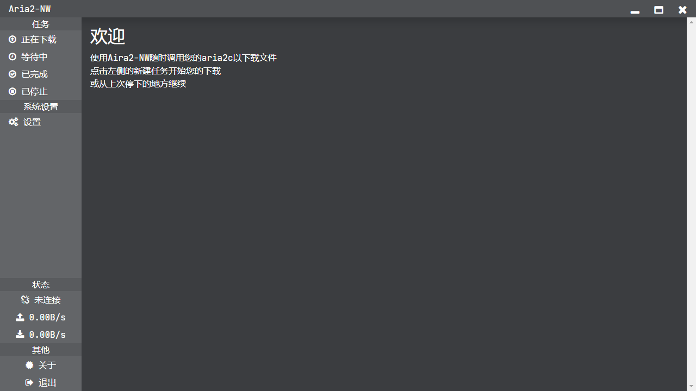

# aria2-nw

Call aria2 via NW.js

## Screenshot



## Install

```
> npm i
```

## Usage

```
> nw
```

## Contributing

All modules' authors and all contributors.

## Feedback

[Submit Issues](https://github.com/jyxjjj/aria2-nw/issues)

or

[Telegram: @jyxjjj](https://t.me/jyxjjj)

## License

[GNU GPL V3](https://github.com/jyxjjj/aria2-nw/blob/master/LICENSE)
